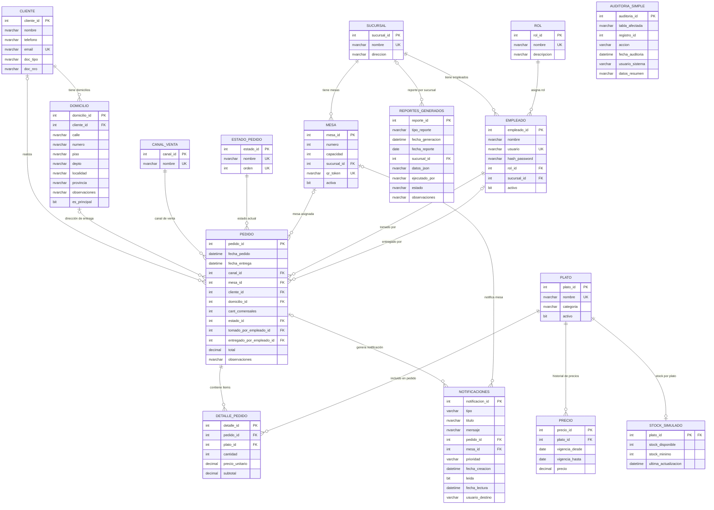

# MODELO ENTIDAD-RELACIÓN — SISTEMA ESBIRROSDB

## **INFORMACIÓN DEL DOCUMENTO**

| **Campo**         | **Descripción**                                  |
|-------------------|--------------------------------------------------|
| **Documento**     | Modelo Entidad-Relación (DER) — EsbirrosDB       |
| **Proyecto**      | Sistema de Gestión de Bodegón Porteño            |
| **Cliente**       | Bodegón Los Esbirros de Claudio                  |
| **Instituto**     | ISTEA                                            |
| **Versión**       | 2.0                                              |
| **Estado**        | Implementado y Funcional                         |

---

## **RESUMEN EJECUTIVO**

### Objetivo del Documento
Presenta el Modelo Entidad-Relación del sistema **EsbirrosDB**, diseñado para la gestión operativa del **Bodegón Los Esbirros de Claudio**. Documenta las relaciones entre entidades y la arquitectura visual del modelo de datos.

### Componentes del Modelo

| **Métrica**           | **Valor** |
|-----------------------|-----------|
| Entidades (tablas A1) | 12        |
| Tablas auxiliares     | 4 (AUDITORIA_SIMPLE, STOCK_SIMULADO, NOTIFICACIONES, REPORTES_GENERADOS) |
| **Total tablas**      | **16**    |
| Relaciones FK         | 17        |
| Módulos funcionales   | 7         |

### Decisiones de Diseño
- **`DETALLE_PEDIDO` directo:** `plato_id NOT NULL`, cada ítem referencia un plato individual
- **Contexto de negocio:** bodegón porteño (cocina a la leña, pastas, carnes)

---

## **DIAGRAMA ENTIDAD-RELACIÓN COMPLETO**

> Renderizable en [mermaid.live](https://mermaid.live) o en cualquier editor compatible con Mermaid (VS Code + extensión, GitHub, Notion, etc.)



---

## **DESCRIPCIÓN DE MÓDULOS**

### Módulo 1 — Catálogos Base
| Tabla | Rol | Cardinalidad clave |
|-------|-----|--------------------|
| `SUCURSAL` | Hub central del sistema | 1:N con MESA y EMPLEADO |
| `CANAL_VENTA` | Catalog de canales (Mesa QR, Delivery, etc.) | 1:N con PEDIDO |
| `ESTADO_PEDIDO` | Estados ordenados del flujo | 1:N con PEDIDO |
| `ROL` | Roles del personal | 1:N con EMPLEADO |

### Módulo 2 — Personal y Ubicación
| Tabla | Rol | Cardinalidad clave |
|-------|-----|--------------------|
| `MESA` | Mesas físicas con QR | N:1 con SUCURSAL |
| `EMPLEADO` | Personal con autenticación | N:1 con ROL y SUCURSAL |

### Módulo 3 — Clientes
| Tabla | Rol | Cardinalidad clave |
|-------|-----|--------------------|
| `CLIENTE` | Datos del cliente | 1:N con DOMICILIO |
| `DOMICILIO` | Direcciones de entrega | N:1 con CLIENTE |

### Módulo 4 — Productos y Precios
| Tabla | Rol | Cardinalidad clave |
|-------|-----|--------------------|
| `PLATO` | Catálogo del menú (pastas, carnes, bebidas…) | 1:N con PRECIO, DETALLE_PEDIDO |
| `PRECIO` | Historial de precios con vigencia temporal | N:1 con PLATO |

### Módulo 5 — Pedidos
| Tabla | Rol | Cardinalidad clave |
|-------|-----|--------------------|
| `PEDIDO` | Entidad central de transacciones | N:1 con múltiples catálogos |
| `DETALLE_PEDIDO` | Líneas de pedido (siempre un plato) | N:1 con PEDIDO y PLATO |

### Módulo 6 — Auditoría
| Tabla | Rol | Cardinalidad clave |
|-------|-----|--------------------|
| *(Tabla AUDITORIA eliminada v2.0 — la auditoría se maneja con AUDITORIA_SIMPLE, creada por Bundle E1)* | | |

### Módulo 7 — Reportes
| Tabla | Rol | Cardinalidad clave |
|-------|-----|--------------------|
| `REPORTES_GENERADOS` | Registro de reportes ejecutados | N:1 con SUCURSAL |

### Tablas auxiliares (creadas por Bundles E1/E2/R1)
| Tabla | Bundle | Propósito | FK |
|-------|--------|-----------|----|
| `AUDITORIA_SIMPLE` | E1 | Log simplificado de INSERT/UPDATE/DELETE | — |
| `STOCK_SIMULADO` | E2 | Inventario simulado por plato | `plato_id` → PLATO |
| `NOTIFICACIONES` | E2 | Alertas automáticas de estado de pedidos | `pedido_id` → PEDIDO, `mesa_id` → MESA |
| `REPORTES_GENERADOS` | R1 | Registro de reportes generados por SPs | `sucursal_id` → SUCURSAL |

---

## **FLUJOS DE DATOS CRÍTICOS**

### Flujo 1 — Pedido en Salón (Mesa QR)
```
CANAL_VENTA (Mesa QR) → PEDIDO → DETALLE_PEDIDO → PLATO → PRECIO
                    ↗ MESA ↗ EMPLEADO (mozo)
```

### Flujo 2 — Pedido Delivery
```
CANAL_VENTA (Delivery) → PEDIDO → DETALLE_PEDIDO → PLATO
                      ↗ CLIENTE → DOMICILIO
                      ↗ EMPLEADO (tomado) + EMPLEADO (entregado)
```

### Flujo 3 — Trazabilidad
```
PEDIDO (UPDATE estado) → tr_AuditoriaPedidos → AUDITORIA_SIMPLE
                       → tr_SistemaNotificaciones → NOTIFICACIONES
```

---

**Documento generado por SQLeaders S.A.**  
**Versión: 2.0 — Adaptación EsbirrosDB — 2026**
