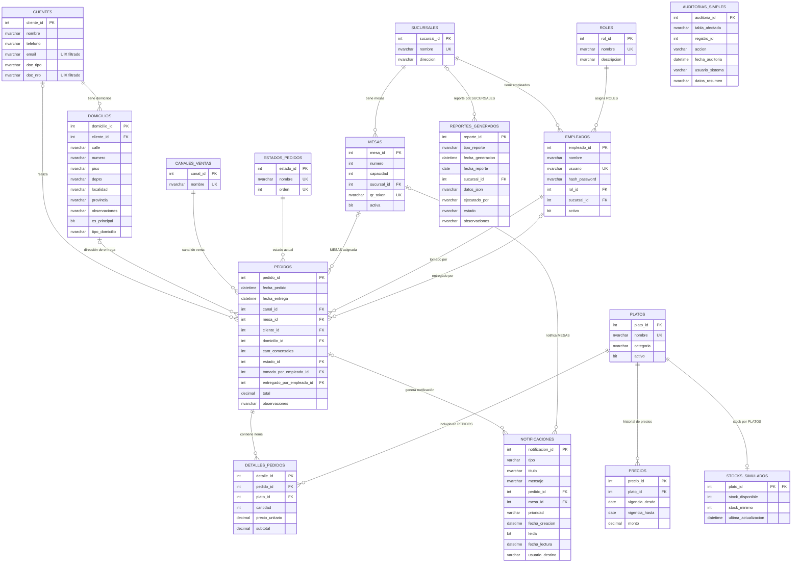

# MODELO ENTIDAD-RELACIÓN — SISTEMA ESBIRROSDB

## **INFORMACIÓN DEL DOCUMENTO**

| **Campo**         | **Descripción**                                  |
|-------------------|--------------------------------------------------|
| **Documento**     | Modelo Entidad-Relación (DER) — EsbirrosDB       |
| **Proyecto**      | Sistema de Gestión de Bodegón Porteño            |
| **CLIENTES**       | Bodegón Los Esbirros de Claudio                  |
| **Instituto**     | ISTEA                                            |
| **Materia**       | Laboratorio de Administración de Bases de Datos  |
| **Profesor**      | Carlos Alejandro Caraccio                        |
| **Versión**       | 1.0                                              |
| **Estado**        | Implementado y Funcional                         |

---

## **RESUMEN EJECUTIVO**

### Objetivo del Documento
Presenta el Modelo Entidad-Relación del sistema **EsbirrosDB**, diseñado para la gestión operativa del **Bodegón Los Esbirros de Claudio**. Documenta las relaciones entre entidades y la arquitectura visual del modelo de datos.

### Componentes del Modelo

| **Métrica**           | **Valor** |
|-----------------------|-----------|
| Entidades (tablas A1) | 12        |
| Tablas auxiliares     | 4 (AUDITORIAS_SIMPLES, STOCKS_SIMULADOS, NOTIFICACIONES, REPORTES_GENERADOS) |
| **Total tablas**      | **16**    |
| Relaciones FK         | 17        |
| Módulos funcionales   | 7         |

### Decisiones de Diseño
- **`DETALLES_PEDIDOS` directo:** `plato_id NOT NULL`, cada ítem referencia un PLATOS individual
- **Contexto de negocio:** bodegón porteño (cocina a la leña, pastas, carnes)

---

## **DIAGRAMA ENTIDAD-RELACIÓN COMPLETO**

> Renderizable en [mermaid.live](https://mermaid.live) o en cualquier editor compatible con Mermaid (VS Code + extensión, GitHub, Notion, etc.)



---

## **DESCRIPCIÓN DE MÓDULOS**

### Módulo 1 — Catálogos Base
| Tabla | Función | Cardinalidad clave |
|-------|-----|--------------------|
| `SUCURSALES` | Hub central del sistema | 1:N con MESAS y EMPLEADOS |
| `CANALES_VENTAS` | Catalog de canales (MESAS QR, Delivery, etc.) | 1:N con PEDIDOS |
| `ESTADOS_PEDIDOS` | Estados ordenados del flujo | 1:N con PEDIDOS |
| `ROLES` | Roles del personal | 1:N con EMPLEADOS |

### Módulo 2 — Personal y Ubicación
| Tabla | Función | Cardinalidad clave |
|-------|-----|--------------------|
| `MESAS` | Mesas físicas con QR | N:1 con SUCURSALES |
| `EMPLEADOS` | Personal con autenticación | N:1 con ROLES y SUCURSALES |

### Módulo 3 — Clientes
| Tabla | Función | Cardinalidad clave |
|-------|-----|--------------------|
| `CLIENTES` | Datos del cliente | 1:N con DOMICILIOS |
| `DOMICILIOS` | Direcciones de entrega | N:1 con CLIENTES |

### Módulo 4 — Productos y Precios
| Tabla | Función | Cardinalidad clave |
|-------|-----|--------------------|
| `PLATOS` | Catálogo del menú (pastas, carnes, bebidas…) | 1:N con PRECIOS, DETALLES_PEDIDOS |
| `PRECIOS` | Historial de precios con vigencia temporal | N:1 con PLATOS |

### Módulo 5 — Pedidos
| Tabla | Función | Cardinalidad clave |
|-------|-----|--------------------|
| `PEDIDOS` | Entidad central de transacciones | N:1 con múltiples catálogos |
| `DETALLES_PEDIDOS` | Líneas de pedido (siempre un PLATOS) | N:1 con PEDIDOS y PLATOS |

### Módulo 6 — Auditoría
| Tabla | Función | Cardinalidad clave |
|-------|-----|--------------------|
| *(Tabla AUDITORIA eliminada v1.0 — la auditoría se maneja con AUDITORIAS_SIMPLES, creada por Bundle E1)* | | |

### Módulo 7 — Reportes
| Tabla | Función | Cardinalidad clave |
|-------|-----|--------------------|
| `REPORTES_GENERADOS` | Registro de reportes ejecutados | N:1 con SUCURSALES |

### Tablas auxiliares (creadas por Bundles E1/E2/R1)
| Tabla | Bundle | Propósito | FK |
|-------|--------|-----------|----|
| `AUDITORIAS_SIMPLES` | E1 | Log simplificado de INSERT/UPDATE/DELETE | — |
| `STOCKS_SIMULADOS` | E2 | Inventario simulado por PLATOS | `plato_id` → PLATOS |
| `NOTIFICACIONES` | E2 | Alertas automáticas de estado de pedidos | `pedido_id` → PEDIDOS, `mesa_id` → MESAS |
| `REPORTES_GENERADOS` | R1 | Registro de reportes generados por SPs | `sucursal_id` → SUCURSALES |

---

## **FLUJOS DE DATOS CRÍTICOS**

### Flujo 1 — PEDIDOS en Salón (MESAS QR)
```
CANALES_VENTAS (MESAS QR) → PEDIDOS → DETALLES_PEDIDOS → PLATOS → PRECIOS
                    ↗ MESAS ↗ EMPLEADOS (mozo)
```

### Flujo 2 — PEDIDOS Delivery
```
CANALES_VENTAS (Delivery) → PEDIDOS → DETALLES_PEDIDOS → PLATOS
                      ↗ CLIENTES → DOMICILIOS
                      ↗ EMPLEADOS (tomado) + EMPLEADOS (entregado)
```

### Flujo 3 — Trazabilidad
```
PEDIDOS (UPDATE estado) → tr_AuditoriaPedidos → AUDITORIAS_SIMPLES
                       → tr_SistemaNotificaciones → NOTIFICACIONES
```

---

**Documento generado por SQLeaders S.A.**  
**Versión: 1.0 — Adaptación EsbirrosDB — 2026**
